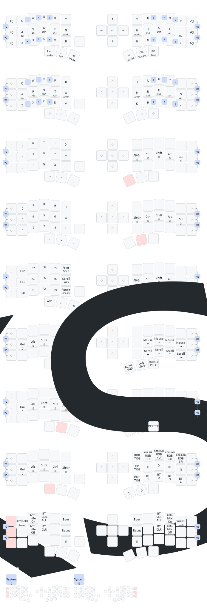

# ZMK Keyboard Config

This repository contains configuration files, scripts, and resources for building and customizing the ZMK firmware for the Eyelash Corne split keyboard.

## Repository Structure
- `boards/` — Board definitions, device trees, and keymap files
- `config/` — User configuration, overlays, and keymaps
- `keymap-drawer/` — Keymap Drawer YAML and SVG visualizations
- `artifacts/` — Compiled firmware files (.uf2) [dev containers only]
- `scripts/` — Helper scripts for building and environment setup
- `zephyr/` — Zephyr RTOS module configuration

## Keymap Visualization
The current keymap layout is visualized below (generated with [Keymap Drawer](https://github.com/caksoylar/keymap-drawer)).

### Eyelash Corne



## Building Firmware

### Github Actions

Run Github Actions Workflows.

### Dev Containers

Run Dev Containers using Visual Studio Code.

To build the firmware, use the provided scripts:

```bash
./scripts/install-yq.sh
./scripts/init-env.sh
./scripts/build-user-config.sh
./scripts/build-keymap.sh
```

The resulting `.uf2` files will be available in the `artifacts/` directory.

## Resources
- [ZMK Documentation](https://zmk.dev/docs/)
- [ZMK Github](https://github.com/zmkfirmware/zmk)
- [Keymap Drawer](https://github.com/caksoylar/keymap-drawer)
- [Eyelash Corne](https://github.com/a741725193/zmk-new_corne)
